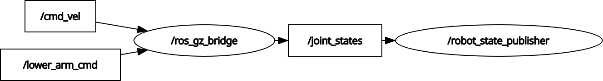

# warehouse_robot

A ROS2 Level 2 project: a warehouse robot with a differential-drive mobile base and a 3-DOF robotic arm, simulated in Gazebo Harmonic.
## Demo


---

## English

### Overview
The robot combines a red diff-drive base (two drive wheels + one caster) with a 3-joint arm (arm_base → lower_arm → upper_arm → gripper) mounted on the rear quarter of the base. The base is driven via `/cmd_vel`; each of the 3 arm joints is controlled independently.

### Robot Structure

**Mobile base**
- base_link (box, red): 0.5 × 0.3 × 0.15
- left/right wheel (cylinder): r=0.08, l=0.04 — continuous
- caster wheel (sphere): r=0.04 — fixed (rear, for balance)

**Arm (3 joints)**
- arm_base_link (box, orange): 0.08 × 0.08 × 0.02
- lower_arm_link (cylinder, blue): r=0.02, l=0.25 — p_gain 4.0
- upper_arm_link (cylinder, green): r=0.02, l=0.20 — p_gain 3.0
- gripper_link (box, yellow): 0.05 × 0.05 × 0.05 — p_gain 2.0
- All joints: revolute, limit 0 → π/2

### Packages
- `warehouse_robot_description` — URDF/Xacro, RViz, description launch
- `warehouse_robot_bringup` — Gazebo launch, bridge config

### Build
​```bash
cd ~/ros2_ws
colcon build --symlink-install
source install/setup.bash
​```

### Run
​```bash
ros2 launch warehouse_robot_bringup warehouse_robot_gazebo.launch.py
​```

Move the base:
​```bash
ros2 topic pub /cmd_vel geometry_msgs/msg/Twist "{linear: {x: 0.3}, angular: {z: 0.0}}"
​```

Control each arm joint:
​```bash
ros2 topic pub --once /lower_arm_cmd std_msgs/msg/Float64 "{data: 1.0}"
ros2 topic pub --once /upper_arm_cmd std_msgs/msg/Float64 "{data: 1.0}"
ros2 topic pub --once /gripper_cmd  std_msgs/msg/Float64 "{data: 1.0}"
​```

### Tech Stack
Ubuntu 24.04 · ROS2 Jazzy · Gazebo Harmonic · URDF/Xacro · ros_gz_sim · ros_gz_bridge

---

## 日本語

### 概要
赤い差動駆動ベース（駆動輪2つ＋キャスター1つ）と、ベース後方1/4に取り付けた3関節アーム（arm_base → lower_arm → upper_arm → gripper）を組み合わせた倉庫ロボットです。ベースは `/cmd_vel` で走行し、3つのアーム関節はそれぞれ独立して制御できます。

### ロボット構成

**移動ベース**
- base_link（箱型・赤）：0.5 × 0.3 × 0.15
- 左右の車輪（円柱）：r=0.08, l=0.04 — continuous
- キャスター（球）：r=0.04 — fixed（バランスのため後方に配置）

**アーム（3関節）**
- arm_base_link（箱型・オレンジ）：0.08 × 0.08 × 0.02
- lower_arm_link（円柱・青）：r=0.02, l=0.25 — p_gain 4.0
- upper_arm_link（円柱・緑）：r=0.02, l=0.20 — p_gain 3.0
- gripper_link（箱型・黄）：0.05 × 0.05 × 0.05 — p_gain 2.0
- 全関節：revolute、可動範囲 0 → π/2

### パッケージ
- `warehouse_robot_description` — URDF/Xacro、RViz、description launch
- `warehouse_robot_bringup` — Gazebo launch、bridge 設定

### ビルド
​```bash
cd ~/ros2_ws
colcon build --symlink-install
source install/setup.bash
​```

### 実行
​```bash
ros2 launch warehouse_robot_bringup warehouse_robot_gazebo.launch.py
​```

ベースを動かす：
​```bash
ros2 topic pub /cmd_vel geometry_msgs/msg/Twist "{linear: {x: 0.3}, angular: {z: 0.0}}"
​```

各アーム関節を制御する：
​```bash
ros2 topic pub --once /lower_arm_cmd std_msgs/msg/Float64 "{data: 1.0}"
ros2 topic pub --once /upper_arm_cmd std_msgs/msg/Float64 "{data: 1.0}"
ros2 topic pub --once /gripper_cmd  std_msgs/msg/Float64 "{data: 1.0}"
​```

### 技術スタック
Ubuntu 24.04 · ROS2 Jazzy · Gazebo Harmonic · URDF/Xacro · ros_gz_sim · ros_gz_bridge

---

## Node & Topic Graph / ノード・トピックグラフ

